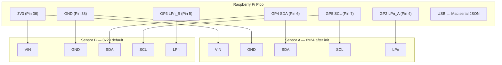

# VL53L5CX V2 Dual Sensor — Test Plan & Integration Guide

## Hardware Wiring

Both sensors share the same I2C bus (GP4/GP5). Each gets its own LPn (XSHUT) GPIO so their I2C addresses can be differentiated at boot.

```
Pico 3V3 (Pin 36) ──┬──── VIN  [Sensor A]
                    └──── VIN  [Sensor B]

Pico GND  (Pin 38) ──┬──── GND  [Sensor A]
                    └──── GND  [Sensor B]

Pico GP4  (Pin 6)  ──┬──── SDA  [Sensor A]   ← I2C0 shared bus
                    └──── SDA  [Sensor B]

Pico GP5  (Pin 7)  ──┬──── SCL  [Sensor A]   ← I2C0 shared bus
                    └──── SCL  [Sensor B]

Pico GP2  (Pin 4)  ──────── LPn [Sensor A]   ← individual enable
Pico GP3  (Pin 5)  ──────── LPn [Sensor B]   ← individual enable
```

**Note:** Most breakout boards (SparkFun, Pimoroni) include onboard I2C pull-up resistors. If both boards have pull-ups active simultaneously, cut the jumper on one board so the combined bus pull-up stays near 4.7kΩ.

**Angle & spacing:** Place sensors 300mm apart (center-to-center), both angled 45° toward the user. The sensor reports slant distance; apply `true_distance = reported_mm × cos(45°) × 0.707` in firmware if you need perpendicular projection.

---

## Wiring Diagram



---

## I2C Address Initialization Sequence

Both sensors power up at `0x29`. The LPn pins are used to boot them one at a time:

1. Pull both LPn LOW → both sensors off
2. Raise LPn_A HIGH → Sensor A boots at `0x29`
3. Reassign Sensor A to `0x2A` via I2C command
4. Raise LPn_B HIGH → Sensor B boots at `0x29`
5. Both sensors are now live: **A = `0x2A`**, **B = `0x29`**

This must run on every boot (addresses are not stored on the sensor).

---

## Software Library

**Use:** [`stm32duino/VL53L5CX`](https://github.com/stm32duino/VL53L5CX) — official ST Arduino library, compatible with the Arduino-Pico core.

**Install via Arduino IDE Library Manager:**

Search `VL53L5CX` → install **"VL53L5CX by STMicroelectronics"**

**Arduino-Pico core (if not already installed):**

In Arduino IDE → Preferences → Additional boards manager URLs, add:
```
https://github.com/earlephilhower/arduino-pico/releases/download/global/package_rp2040_index.json
```
Then: Boards Manager → search `Raspberry Pi Pico/RP2040` → Install

**Note:** The sensor uploads ~86KB of firmware over I2C at every boot. `Wire.setClock(1000000)` (1 MHz) keeps startup under 2 seconds.

---

## Test Plan

### Phase 1 — Single Sensor Verification

- Wire only Sensor A (LPn wired to GP2, driven HIGH in code)
- Open `firmware/phase1_single_sensor/phase1_single_sensor.ino` in Arduino IDE
- Select board: **Raspberry Pi Pico**, correct COM port
- Upload and open Serial Monitor at **115200 baud**
- Confirm: sensor boots, ranges return valid mm values in the 100–4000mm window
- Move hand toward/away from sensor, confirm values track in real time

### Phase 2 — Dual Sensor Verification

- Wire Sensor B (LPn → GP3)
- Open `firmware/phase2_dual_sensor/phase2_dual_sensor.ino`, upload
- Confirm both sensors appear on the bus (printed to Serial Monitor)
- Read from each sensor independently, verify no cross-talk or address collision

### Phase 3 — 45° Placement Test

- Mount both sensors 300mm apart (center-to-center), angled 45° toward seated rider position
- See `docs/phase3_placement_test.md` for full pass criteria and cosine correction validation

### Phase 4 — Serial JSON Output

Open `firmware/main/main.ino`, upload to the Pico. It emits newline-delimited JSON at 20Hz:

```json
{"tof":[{"id":"tof-chest","mm":215,"min":100,"max":700},{"id":"tof-lean","mm":310,"min":100,"max":700}]}
```

- Connect Pico USB to Mac
- Connect in Mission Control via the serial port dropdown
- Confirm `TofSensorDisplay` bars animate live in the **Live Inputs** panel

---

## Integration Notes

- `minMm` / `maxMm` in Mission Control `inputStore.ts` is set to `100–700` to match the 45° mount geometry
- The `TofSensorDisplay` color thresholds are percentage-based — updating range in the JSON frame is all that's needed
- Store IDs `"tof-chest"` and `"tof-lean"` must match exactly what the Pico firmware sends

## Status

| Phase | Status |
|-------|--------|
| Phase 1 — Single sensor | ✅ Complete |
| Phase 2 — Dual sensor   | ✅ Complete |
| Phase 3 — Placement test | ✅ Complete |
| Phase 4 — Serial JSON    | ✅ Complete |
| Range tuning (100–700mm) | ✅ Complete |
